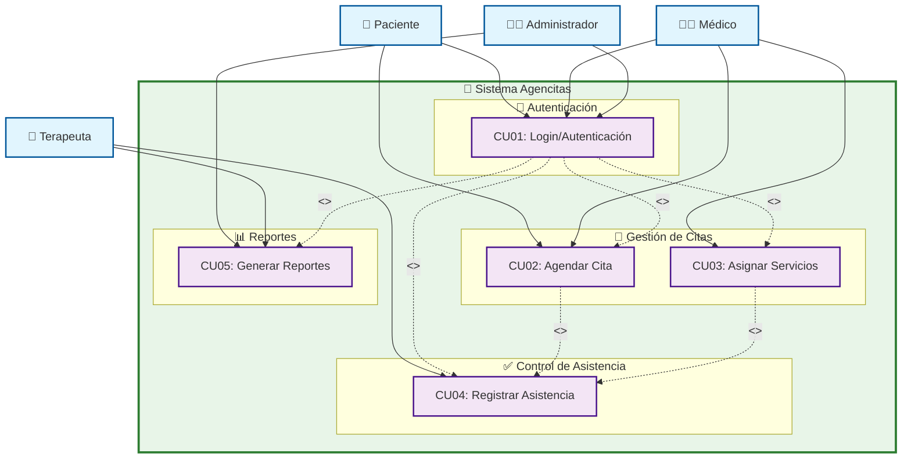

# 📊 DIAGRAMA DE CASOS DE USO - SISTEMA AGENCITAS

## 🎯 Casos de Uso del Sistema de Rehabilitación

### 📋 Tabla de Casos de Uso

| **Código** | **Nombre del Caso de Uso** | **Actor** | **Descripción Breve** | **Precondiciones** | **Flujo Principal** | **Flujo Alterno** |
|------------|----------------------------|-----------|------------------------|-------------------|--------------------|--------------------|
| **CU01** | Login / Autenticación | Paciente, Médico, Administrador | Permitir que el usuario ingrese al sistema con usuario y contraseña. | Usuario registrado con credenciales válidas. | 1. Usuario ingresa usuario y contraseña.<br>2. Sistema valida y concede acceso. | 1. Usuario ingresa credenciales incorrectas → Sistema muestra mensaje de error. |
| **CU02** | Agendar Cita | Paciente, Médico | Programar una cita para un paciente en un servicio de rehabilitación. | Usuario autenticado. Servicios disponibles. | 1. Selecciona paciente y servicio.<br>2. Escoge fecha y hora.<br>3. Confirma cita. | 1. Servicio no disponible → Sistema muestra alternativas de horario. |
| **CU03** | Asignar Servicios | Médico | Derivar al paciente a salas específicas según el diagnóstico. | Paciente con diagnóstico registrado. | 1. Médico selecciona paciente.<br>2. Sistema asigna salas según diagnóstico. | 1. Paciente excede máximo de 3 servicios → Sistema bloquea asignación. |
| **CU04** | Registrar Asistencia | Terapeuta | Registrar que el paciente asistió a su sesión de rehabilitación. | Paciente con cita programada. | 1. Terapeuta selecciona paciente.<br>2. Marca asistencia en el sistema. | 1. Paciente no se presenta → Sistema registra inasistencia. |
| **CU05** | Generar Reportes | Administrador, Terapeuta | Obtener reportes de citas, asistencia y pacientes atendidos. | Datos de citas y asistencia registrados. | 1. Selecciona rango de fechas y especialista.<br>2. Sistema genera reporte. | 1. No hay datos disponibles → Sistema muestra mensaje indicando ausencia de datos. |

---

## 🔄 Diagrama de Casos de Uso (Mermaid)



---

## 📖 Descripción Detallada de Casos de Uso

### 🔐 **CU01: Login / Autenticación**
- **Actores:** Paciente, Médico, Administrador
- **Propósito:** Control de acceso al sistema
- **Trigger:** Usuario intenta acceder al sistema
- **Resultado:** Acceso concedido o denegado

### 📅 **CU02: Agendar Cita**
- **Actores:** Paciente, Médico
- **Propósito:** Programar citas de rehabilitación
- **Trigger:** Necesidad de programar sesión
- **Resultado:** Cita programada exitosamente

### 🏥 **CU03: Asignar Servicios**
- **Actores:** Médico
- **Propósito:** Derivar pacientes a servicios específicos
- **Trigger:** Diagnóstico médico completado
- **Resultado:** Servicios asignados según diagnóstico

### ✅ **CU04: Registrar Asistencia**
- **Actores:** Terapeuta
- **Propósito:** Control de asistencia a sesiones
- **Trigger:** Paciente llega a su cita
- **Resultado:** Asistencia registrada

### 📊 **CU05: Generar Reportes**
- **Actores:** Administrador, Terapeuta
- **Propósito:** Obtener información estadística
- **Trigger:** Necesidad de análisis de datos
- **Resultado:** Reporte generado

---

## 🔗 Relaciones entre Casos de Uso

### **Include (Inclusión)**
- Todos los casos de uso **incluyen** autenticación (CU01)
- Es obligatorio estar autenticado para realizar cualquier acción

### **Extend (Extensión)**
- CU02 (Agendar Cita) **extiende** a CU04 (Registrar Asistencia)
- CU03 (Asignar Servicios) **extiende** a CU04 (Registrar Asistencia)
- La asistencia se registra como consecuencia de citas programadas

---

## 🎭 Roles y Permisos

| **Actor** | **CU01** | **CU02** | **CU03** | **CU04** | **CU05** |
|-----------|----------|----------|----------|----------|----------|
| **👤 Paciente** | ✅ | ✅ | ❌ | ❌ | ❌ |
| **👩‍⚕️ Médico** | ✅ | ✅ | ✅ | ❌ | ❌ |
| **👨‍💼 Administrador** | ✅ | ❌ | ❌ | ❌ | ✅ |
| **🏥 Terapeuta** | ✅ | ❌ | ❌ | ✅ | ✅ |

---

## 🔄 Flujos de Proceso

### **Flujo Principal: Paciente**
```
1. Login (CU01) → 2. Agendar Cita (CU02) → 3. Asistir a Cita → 4. Registro de Asistencia (CU04)
```

### **Flujo Principal: Médico**
```
1. Login (CU01) → 2. Asignar Servicios (CU03) → 3. Agendar Cita (CU02)
```

### **Flujo Principal: Administrador**
```
1. Login (CU01) → 2. Generar Reportes (CU05) → 3. Análisis de Datos
```

### **Flujo Principal: Terapeuta**
```
1. Login (CU01) → 2. Registrar Asistencia (CU04) → 3. Generar Reportes (CU05)
```

---

## ⚠️ Excepciones y Flujos Alternos

### **CU01 - Autenticación Fallida**
- **Condición:** Credenciales incorrectas
- **Acción:** Mostrar mensaje de error y permitir reintento
- **Límite:** 3 intentos fallidos = bloqueo temporal

### **CU02 - Servicio No Disponible**
- **Condición:** Horario solicitado ocupado
- **Acción:** Mostrar horarios alternativos disponibles
- **Resolución:** Usuario selecciona nueva fecha/hora

### **CU03 - Límite de Servicios Excedido**
- **Condición:** Paciente ya tiene 3 servicios asignados
- **Acción:** Bloquear nueva asignación
- **Resolución:** Completar servicios actuales antes de asignar nuevos

### **CU04 - Paciente No Se Presenta**
- **Condición:** Paciente no asiste a cita programada
- **Acción:** Registrar inasistencia automáticamente
- **Consecuencia:** Actualizar estadísticas de no-shows

### **CU05 - Sin Datos Disponibles**
- **Condición:** Rango de fechas sin registros
- **Acción:** Mostrar mensaje informativo
- **Sugerencia:** Modificar criterios de búsqueda